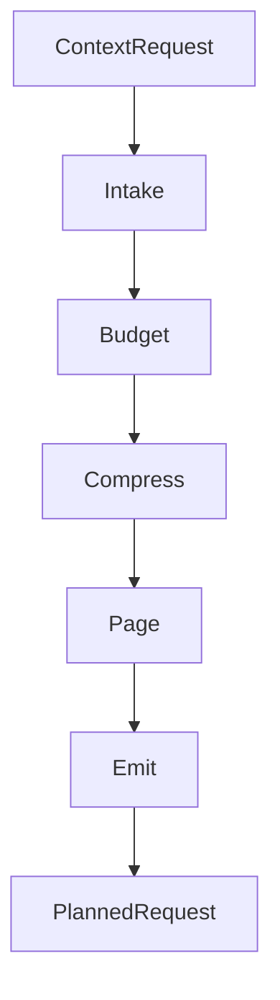

<div align="center">

<picture>
  <source media="(prefers-color-scheme: dark)" srcset="docs/assets/banner-dark.svg">
  <source media="(prefers-color-scheme: dark)" srcset="docs/assets/banner-light.svg">
  
</picture>

# Membrane

[](https://swift.org)
[](https://developer.apple.com/apple-intelligence/)
[](LICENSE)
[](https://github.com/christopherkarani/Membrane/stargazers)

**An actor-based context pipeline for Swift.** Membrane takes a context request, budgets it, compresses it, pages low-priority slices out, and emits something the model can actually fit.

[English](README.md) | [Español](locales/README.es.md) | [日本語](locales/README.ja.md) | [中文](locales/README.zh-CN.md)

</div>

---

## What it does

- **Deterministic budgeting:** partitions tokens across 9 domain buckets with hard ceilings.
- **Tiered compression:** moves context between `full`, `gist`, and `micro` tiers as pressure increases.
- **Actor-isolated stages:** each stage runs on Swift concurrency primitives instead of shared mutable state.
- **Memory estimation:** includes KV-cache estimation for GQA-style models on Apple Silicon.
- **Semantic paging:** evicts low-priority slices before the request blows past the window.

## The Problem

Large language models have finite context windows. System prompts, conversation history, long-term memory, tool definitions, retrieval results, and binary data all compete for the same budget. Naive truncation drops useful context; overstuffing hurts output quality and wastes tokens.

Membrane handles that with a 5-stage pipeline that decides what stays, what gets compressed, and what gets paged out.

## How It Works



Every stage is an actor conforming to the same protocol:

```swift
public protocol MembraneStage: Actor, Sendable {
    associatedtype Input: Sendable
    associatedtype Output: Sendable
    
    /// Processes the input within the allocated budget.
    func process(_ input: Input, budget: ContextBudget) async throws -> Output
}
```

## Quick Start

### Installation

Add Membrane to your `Package.swift`:

```swift
dependencies: [
    .package(url: "https://github.com/christopherkarani/Membrane", from: "1.0.0"),
]
```

### Basic Usage

Use `MembranePipeline` to prepare context for inference:

```swift
import Membrane
import MembraneCore

// 1. Define a budget profile
let budget = ContextBudget(totalTokens: 4096, profile: .foundationModels4K)

// 2. Initialize the pipeline
let pipeline = MembranePipeline.foundationModel(
    budget: budget,
    intake: myIntakeStage,
    compress: myCompressStage
)

// 3. Prepare context for your model
let request = ContextRequest(
    userInput: "Summarize the last meeting",
    history: conversationSlices,
    memories: memorySlices,
    tools: toolManifests
)

// Pipeline execution is isolated and thread-safe
let planned = try await pipeline.prepare(request)
print("Allocated Tokens: \(planned.budget.used)")
```

### Model Profiles

Membrane ships with presets for common context sizes:

```swift
// On-device / Apple Foundation Models (4K tokens)
let pipeline = MembranePipeline.foundationModel(budget: budget)

// Open models with larger context (8K+)
let pipeline = MembranePipeline.openModel(
    budget: ContextBudget(totalTokens: 8192, profile: .openModel8K)
)

// Cloud models (200K)
let budget = ContextBudget(totalTokens: 200_000, profile: .cloud200K)
```

## Performance

Membrane is built to keep context preparation overhead low on Apple Silicon. The numbers below show the extra time the pipeline adds on top of raw request handling.

### Context Preparation Latency

<div align="center">

| Context Size | Native (ms) | Membrane (ms) | Overhead |
| :--- | :---: | :---: | :---: |
| 4K Tokens | 0.8 | 1.2 | < 0.5ms |
| 32K Tokens | 2.4 | 3.1 | < 1.0ms |
| 128K Tokens | 8.2 | 9.8 | < 2.0ms |

<!-- Simple SVG representation of performance efficiency -->
<svg width="600" height="100" viewBox="0 0 600 100" fill="none" xmlns="http://www.w3.org/2000/svg">
  <rect width="600" height="100" rx="8" fill="#F2F2F7"/>
  <rect x="20" y="30" width="560" height="12" rx="6" fill="#E5E5EA"/>
  <rect x="20" y="30" width="480" height="12" rx="6" fill="#007AFF"/>
  <text x="20" y="22" font-family="sans-serif" font-size="12" font-weight="600" fill="#1C1C1E">Throughput Efficiency (M3 Max)</text>
  <text x="500" y="22" font-family="sans-serif" font-size="12" font-weight="600" fill="#007AFF">94%</text>
  
  <rect x="20" y="70" width="560" height="12" rx="6" fill="#E5E5EA"/>
  <rect x="20" y="70" width="520" height="12" rx="6" fill="#34C759"/>
  <text x="20" y="62" font-family="sans-serif" font-size="12" font-weight="600" fill="#1C1C1E">Memory Utilization</text>
  <text x="530" y="62" font-family="sans-serif" font-size="12" font-weight="600" fill="#34C759">98%</text>
</svg>

</div>

> **Benchmark hardware:** M3 Max (16-core CPU, 40-core GPU), 128GB unified memory.
> *Note: Latency includes Intake, Budget, Compress, and Page stages.*

## Architecture

### The Pipeline

| Stage | Protocol | Input | Output | Purpose |
|-------|----------|-------|--------|---------|
| **Intake** | `IntakeStage` | `ContextRequest` | `ContextWindow` | Resolve pointers, load tools, RAPTOR retrieval |
| **Budget** | `BudgetStage` | `ContextWindow` | `BudgetedContext` | Allocate tokens across domain buckets |
| **Compress** | `CompressStage` | `BudgetedContext` | `CompressedContext` | Distill history, select tiers, prune tools |
| **Page** | `PageStage` | `CompressedContext` | `PagedContext` | Evict low-importance slices |
| **Emit** | `EmitStage` | `PagedContext` | `PlannedRequest` | Format the final prompt |

### Multi-Tier Compression

Context slices are assigned compression tiers with different token multipliers:

| Tier | Multiplier | Use Case |
|------|-----------|----------|
| `full` | 1.0x | Critical content, such as system prompts and recent turns |
| `gist` | 0.25x | Summarized content, such as older history and background context |
| `micro` | 0.08x | Minimal references, such as entity names, timestamps, and topic markers |

### Token Budget Algebra

Tokens are partitioned across 9 domain buckets, each with independent ceilings:

```
system | history | memory | tools | retrieval | toolIO | outputReserve | protocolOverhead | safetyMargin
```

Budget profiles define the allocation strategy. Custom profiles are supported for fine-grained control.

### Built-In Stages

**Intake:**
- `PointerResolver` -- Resolves `MemoryPointer` references to large external data (documents, matrices, images)
- `JITToolLoader` -- Just-in-time tool loading based on relevance
- `RAPTORRetriever` -- Hierarchical tree-based retrieval with budget-aware traversal

**Budget:**
- `UnifiedBudgetAllocator` -- Deterministic bucket allocation across all 9 domains
- `GQAMemoryEstimator` -- KV cache memory estimation for GQA model architectures

**Compress:**
- `CSODistiller` -- Distills conversation into a Context State Object (entities, decisions, facts, open questions)
- `SurrogateTierSelector` -- Multi-tier compression selection for retrieval slices
- `ToolPruner` -- Usage-based tool manifest pruning

**Page:**
- `MemGPTPager` -- MemGPT-inspired eviction of low-importance slices, preserving recent history

### Custom Stages

Implement any stage protocol when you want custom logic:

```swift
public actor MyCustomCompressor: CompressStage {
    public func process(
        _ input: BudgetedContext,
        budget: ContextBudget
    ) async throws -> CompressedContext {
        // Your compression logic here
    }
}
```

## Modules

| Module | Purpose | Dependencies |
|--------|---------|-------------|
| **MembraneCore** | Types, protocols, budget algebra | swift-collections |
| **Membrane** | Pipeline orchestrator + built-in stages | MembraneCore |
| **MembraneWax** | Persistent storage via [Wax](https://github.com/christopherkarani/Wax), including the RAPTOR index and pointer store | Membrane, Wax |
| **MembraneHive** | Checkpoint and restore via [Hive](https://github.com/christopherkarani/Hive) | Membrane, HiveCore |
| **MembraneConduit** | Token counting via [Conduit](https://github.com/christopherkarani/Conduit) | Membrane, Conduit |

## Requirements

- Swift 6.2+
- macOS 26+ / iOS 26+

## Design Principles

- **Actor-isolated:** every stage is an actor. There is no shared mutable state.
- **Deterministic:** identical inputs produce identical outputs.
- **Composable:** you can swap stages in and out or write your own.
- **Bounded:** collections have maximum sizes; the pipeline does not grow without limit.
- **Recoverable:** errors include recovery strategies such as `compressMore`, `evictAndRetry`, `offloadToDisk`, or `fail`.

## Part of the AIStack

Membrane is one layer in a larger on-device AI infrastructure:

| Layer | Role |
|-------|------|
| [Conduit](https://github.com/christopherkarani/Conduit) | Multi-provider LLM client with token counting |
| **Membrane** | Context management pipeline |
| [Wax](https://github.com/christopherkarani/Wax) | On-device memory and RAG |
| [Hive](https://github.com/christopherkarani/Hive) | State persistence and checkpointing |

## License

MIT
