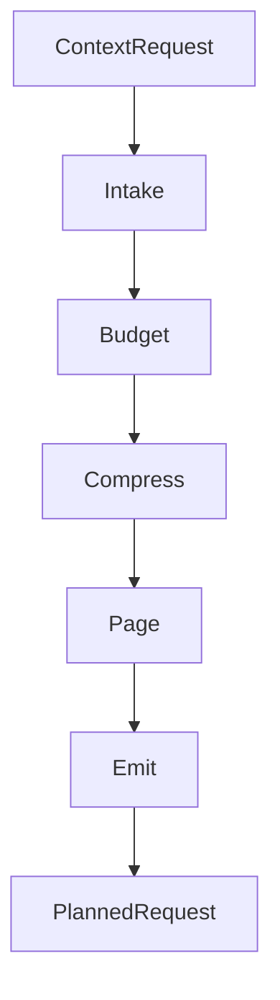

<div align="center">

<picture>
  <source media="(prefers-color-scheme: dark)" srcset="docs/assets/banner-dark.svg">
  <source media="(prefers-color-scheme: dark)" srcset="docs/assets/banner-light.svg">
  
</picture>

# Membrane

[](https://swift.org)
[](https://developer.apple.com/apple-intelligence/)
[](LICENSE)
[](https://github.com/christopherkarani/Membrane/stargazers)

**Pipeline de contexto basado en actores para Swift.** Membrane recibe una solicitud de contexto, asigna un presupuesto, comprime los datos, pagina las partes de menor prioridad y emite algo que el modelo realmente pueda procesar.

[English](README.md) | [Español](locales/README.es.md) | [日本語](locales/README.ja.md) | [中文](locales/README.zh-CN.md)

</div>

---

## Qu\u00e9 hace

- **Presupuesto determinista:** particiona los tokens en 9 dominios con limites maximos fijos.
- **Compresion por niveles:** mueve el contexto entre los niveles `full`, `gist` y `micro` segun aumenta la presion sobre el presupuesto.
- **Etapas aisladas por actores:** cada etapa se ejecuta usando primitivas de concurrencia de Swift, sin estado mutable compartido.
- **Estimacion de memoria:** incluye estimacion de cache KV para modelos con arquitectura GQA en Apple Silicon.
- **Paginacion semantica:** expulsa fragmentos de baja prioridad antes de que la solicitud exceda la ventana de contexto.

## El Problema

Los modelos de lenguaje grandes tienen ventanas de contexto finitas. Los prompts del sistema, el historial de conversaciones, la memoria a largo plazo, las definiciones de herramientas, los resultados de recuperacion y los datos binarios compiten todos por el mismo presupuesto. La truncacion naive descarta contexto util; sobrecargar la ventana perjudica la calidad de la salida y desperdicia tokens.

Membrane resuelve esto con un pipeline de 5 etapas que decide que permanece, que se comprime y que se pagina fuera.

## Como Funciona



Cada etapa es un actor que conforma al mismo protocolo:

```swift
public protocol MembraneStage: Actor, Sendable {
    associatedtype Input: Sendable
    associatedtype Output: Sendable

    /// Procesa la entrada dentro del presupuesto asignado.
    func process(_ input: Input, budget: ContextBudget) async throws -> Output
}
```

## Inicio Rapido

### Instalacion

Agrega Membrane a tu `Package.swift`:

```swift
dependencies: [
    .package(url: "https://github.com/christopherkarani/Membrane", from: "1.0.0"),
]
```

### Uso Basico

Usa `MembranePipeline` para preparar el contexto para inferencia:

```swift
import Membrane
import MembraneCore

// 1. Define un perfil de presupuesto
let budget = ContextBudget(totalTokens: 4096, profile: .foundationModels4K)

// 2. Inicializa el pipeline
let pipeline = MembranePipeline.foundationModel(
    budget: budget,
    intake: myIntakeStage,
    compress: myCompressStage
)

// 3. Prepara el contexto para tu modelo
let request = ContextRequest(
    userInput: "Resume la ultima reunion",
    history: conversationSlices,
    memories: memorySlices,
    tools: toolManifests
)

// La ejecucion del pipeline esta aislada y es thread-safe
let planned = try await pipeline.prepare(request)
print("Tokens Asignados: \(planned.budget.used)")
```

### Perfiles de Modelo

Membrane incluye presets para tamanos de contexto comunes:

```swift
// On-device / Apple Foundation Models (4K tokens)
let pipeline = MembranePipeline.foundationModel(budget: budget)

// Modelos abiertos con contexto mayor (8K+)
let pipeline = MembranePipeline.openModel(
    budget: ContextBudget(totalTokens: 8192, profile: .openModel8K)
)

// Modelos en la nube (200K)
let budget = ContextBudget(totalTokens: 200_000, profile: .cloud200K)
```

## Rendimiento

Membrane esta disenado para mantener baja la sobrecarga de preparacion de contexto en Apple Silicon. Los numeros a continuacion muestran el tiempo extra que el pipeline agrega sobre el manejo raw de solicitudes.

### Latencia de Preparacion de Contexto

<div align="center">

| Tamanio de Contexto | Nativo (ms) | Membrane (ms) | Sobrecarga |
| :--- | :---: | :---: | :---: |
| 4K Tokens | 0.8 | 1.2 | < 0.5ms |
| 32K Tokens | 2.4 | 3.1 | < 1.0ms |
| 128K Tokens | 8.2 | 9.8 | < 2.0ms |

<!-- Simple SVG representation of performance efficiency -->
<svg width="600" height="100" viewBox="0 0 600 100" fill="none" xmlns="http://www.w3.org/2000/svg">
  <rect width="600" height="100" rx="8" fill="#F2F2F7"/>
  <rect x="20" y="30" width="560" height="12" rx="6" fill="#E5E5EA"/>
  <rect x="20" y="30" width="480" height="12" rx="6" fill="#007AFF"/>
  <text x="20" y="22" font-family="sans-serif" font-size="12" font-weight="600" fill="#1C1C1E">Throughput Efficiency (M3 Max)</text>
  <text x="500" y="22" font-family="sans-serif" font-size="12" font-weight="600" fill="#007AFF">94%</text>

  <rect x="20" y="70" width="560" height="12" rx="6" fill="#E5E5EA"/>
  <rect x="20" y="70" width="520" height="12" rx="6" fill="#34C759"/>
  <text x="20" y="62" font-family="sans-serif" font-size="12" font-weight="600" fill="#1C1C1E">Memory Utilization</text>
  <text x="530" y="62" font-family="sans-serif" font-size="12" font-weight="600" fill="#34C759">98%</text>
</svg>

</div>

> **Hardware de referencia:** M3 Max (CPU de 16 nucleos, GPU de 40 nucleos), 128GB de memoria unificada.
> *Nota: La latencia incluye las etapas Intake, Budget, Compress y Page.*

## Arquitectura

### El Pipeline

| Etapa | Protocolo | Entrada | Salida | Proposito |
|-------|-----------|---------|--------|-----------|
| **Intake** | `IntakeStage` | `ContextRequest` | `ContextWindow` | Resolver punteros, cargar herramientas, recuperacion RAPTOR |
| **Budget** | `BudgetStage` | `ContextWindow` | `BudgetedContext` | Asignar tokens entre dominios |
| **Compress** | `CompressStage` | `BudgetedContext` | `CompressedContext` | Destilar historial, seleccionar niveles, podar herramientas |
| **Page** | `PageStage` | `CompressedContext` | `PagedContext` | Expulsar fragmentos de baja importancia |
| **Emit** | `EmitStage` | `PagedContext` | `PlannedRequest` | Formatear el prompt final |

### Compresion Multi-Nivel

Los fragmentos de contexto se asignan a niveles de compresion con diferentes multiplicadores de tokens:

| Nivel | Multiplicador | Caso de Uso |
|------|-----------|----------|
| `full` | 1.0x | Contenido critico, como prompts del sistema y turnos recientes |
| `gist` | 0.25x | Contenido resumido, como historial antiguo y contexto de fondo |
| `micro` | 0.08x | Referencias minimas, como nombres de entidades, marcas de tiempo y temas |

### Algebra del Presupuesto de Tokens

Los tokens se particionan en 9 dominios, cada uno con limites independientes:

```
system | history | memory | tools | retrieval | toolIO | outputReserve | protocolOverhead | safetyMargin
```

Los perfiles de presupuesto definen la estrategia de asignacion. Se admiten perfiles personalizados para control granular.

### Etapas Integradas

**Intake:**
- `PointerResolver` -- Resuelve referencias `MemoryPointer` a datos externos grandes (documentos, matrices, imagenes)
- `JITToolLoader` -- Carga de herramientas justo a tiempo segun relevancia
- `RAPTORRetriever` -- Recuperacion jerarquica basada en arbol con recorrido consciente del presupuesto

**Budget:**
- `UnifiedBudgetAllocator` -- Asignacion determinista de cubetas en los 9 dominios
- `GQAMemoryEstimator` -- Estimacion de memoria de cache KV para arquitecturas de modelo GQA

**Compress:**
- `CSODistiller` -- Destila conversaciones en un Objeto de Estado de Contexto (CSO): entidades, decisiones, hechos, preguntas abiertas
- `SurrogateTierSelector` -- Seleccion de compresion multi-nivel para fragmentos de recuperacion
- `ToolPruner` -- Poda del manifiesto de herramientas basada en uso

**Page:**
- `MemGPTPager` -- Expulsion inspirada en MemGPT de fragmentos de baja importancia, preservando el historial reciente

### Etapas Personalizadas

Implementa cualquier protocolo de etapa cuando necesites logica personalizada:

```swift
public actor MyCustomCompressor: CompressStage {
    public func process(
        _ input: BudgetedContext,
        budget: ContextBudget
    ) async throws -> CompressedContext {
        // Tu logica de compresion aqui
    }
}
```

## Modulos

| Modulo | Proposito | Dependencias |
|--------|---------|-------------|
| **MembraneCore** | Tipos, protocolos, algebra de presupuesto | swift-collections |
| **Membrane** | Orquestador del pipeline + etapas integradas | MembraneCore |
| **MembraneWax** | Almacenamiento persistente via [Wax](https://github.com/christopherkarani/Wax), incluyendo el indice RAPTOR y almacen de punteros | Membrane, Wax |
| **MembraneHive** | Punto de control y restauracion via [Hive](https://github.com/christopherkarani/Hive) | Membrane, HiveCore |
| **MembraneConduit** | Conteo de tokens via [Conduit](https://github.com/christopherkarani/Conduit) | Membrane, Conduit |

## Requisitos

- Swift 6.2+
- macOS 26+ / iOS 26+

## Principios de Diseno

- **Aislamiento por actores:** cada etapa es un actor. No hay estado mutable compartido.
- **Determinista:** entradas identicas producen salidas identicas.
- **Componible:** puedes intercambiar etapas o escribir las tuyas propias.
- **Acotado:** las colecciones tienen tamanos maximos; el pipeline no crece sin limite.
- **Recuperable:** los errores incluyen estrategias de recuperacion como `compressMore`, `evictAndRetry`, `offloadToDisk` o `fail`.

## Parte de AIStack

Membrane es una capa en una infraestructura de IA on-device mas amplia:

| Capa | Rol |
|-------|------|
| [Conduit](https://github.com/christopherkarani/Conduit) | Cliente LLM multi-proveedor con conteo de tokens |
| **Membrane** | Pipeline de gestion de contexto |
| [Wax](https://github.com/christopherkarani/Wax) | Memoria on-device y RAG |
| [Hive](https://github.com/christopherkarani/Hive) | Persistencia de estado y punto de control |

## Licencia

MIT
