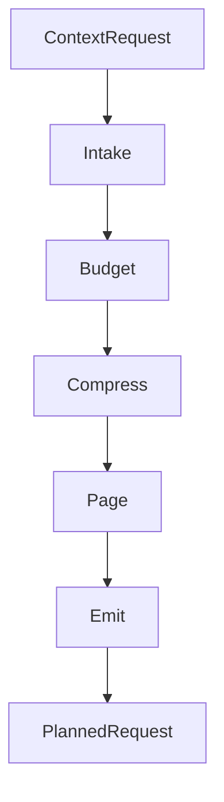

<div align="center">

<picture>
  <source media="(prefers-color-scheme: dark)" srcset="docs/assets/banner-dark.svg">
  <source media="(prefers-color-scheme: dark)" srcset="docs/assets/banner-light.svg">
  
</picture>

# Membrane

[](https://swift.org)
[](https://developer.apple.com/apple-intelligence/)
[](LICENSE)
[](https://github.com/christopherkarani/Membrane/stargazers)

**Swift向けアクターベース・コンテキスト・パイプライン。** Membraneはコンテキスト要求を受け取り、バジェット（予算）を配分し、圧縮し、優先度の低いスライスをページアウトしてモデルが実際に処理できるサイズで出力します。

[English](../README.md) | [Español](README.es.md) | [日本語](README.ja.md) | [中文](README.zh-CN.md)

</div>

---

## 主な機能

- **決定論的バジェット管理:** 9つのドメインバケットにトークンを分割し、厳格な上限を適用します。
- **階層的圧縮:** 压力が高まるとコンテキストを`full`、`gist`、`micro`のティア間で移動させます。
- **アクター分離ステージ:** 各ステージは共有的可変状態ではなく、Swift並行処理プリミティブ上で実行されます。
- **メモリ推定:** Apple Silicon上のGQAスタイルモデルに対するKVキャッシュ推定を含まれています。
- **セマンティック・ページング:** リクエストがウィンドウ上限を超える前に、優先度の低いスライスを退去させます。

## 解决的问题

大規模言語モデルは有限のコンテキストウィンドウ持っています。システムプロンプト、会話履歴、長期メモリ、ツール定義、検索結果、バイナリデータはすべて同じバジェットを競合します。単純な切り捨ては有用なコンテキストをドロップし、オーバースタッフィングは出力品質を低下させトークンを浪費します。

Membraneは5ステージのパイプラインで何を保持し、何を圧縮し、何をページアウトするかを決定します。

## 動作原理



すべてのステージは同一のプロトコルに準拠するアクターです:

```swift
public protocol MembraneStage: Actor, Sendable {
    associatedtype Input: Sendable
    associatedtype Output: Sendable

    /// 指定されたバジェット内で入力を処理します。
    func process(_ input: Input, budget: ContextBudget) async throws -> Output
}
```

## クイックスタート

### インストール

`Package.swift`にMembraneを追加します:

```swift
dependencies: [
    .package(url: "https://github.com/christopherkarani/Membrane", from: "1.0.0"),
]
```

### 基本的な使い方

`MembranePipeline`を使用して推論用のコンテキストを準備します:

```swift
import Membrane
import MembraneCore

// 1. バジェットプロファイルを定義
let budget = ContextBudget(totalTokens: 4096, profile: .foundationModels4K)

// 2. パイプラインを初期化
let pipeline = MembranePipeline.foundationModel(
    budget: budget,
    intake: myIntakeStage,
    compress: myCompressStage
)

// 3. モデル用のコンテキストを準備
let request = ContextRequest(
    userInput: "最後の会議を要約してください",
    history: conversationSlices,
    memories: memorySlices,
    tools: toolManifests
)

// パイプライン実行は分離されスレッドセーフ
let planned = try await pipeline.prepare(request)
print("配分トークン数: \(planned.budget.used)")
```

### モデルプロファイル

Membraneは一般的なコンテキストサイズ用のプリセットを付属しています:

```swift
// デバイス向け / Apple Foundation Models (4Kトークン)
let pipeline = MembranePipeline.foundationModel(budget: budget)

// 大きなコンテキストを持つオープンモデル (8K以上)
let pipeline = MembranePipeline.openModel(
    budget: ContextBudget(totalTokens: 8192, profile: .openModel8K)
)

// クラウドモデル (200K)
let budget = ContextBudget(totalTokens: 200_000, profile: .cloud200K)
```

## パフォーマンス

MembraneはApple Silicon上でのコンテキスト準備オーバーヘッドを低く抑えるために構築されています。以下は、生のリクエスト処理に対するパイプラインが追加する余分な時間を示しています。

### コンテキスト準備レイテンシ

<div align="center">

| コンテキストサイズ | ネイティブ (ms) | Membrane (ms) | オーバーヘッド |
| :--- | :---: | :---: | :---: |
| 4K トークン | 0.8 | 1.2 | < 0.5ms |
| 32K トークン | 2.4 | 3.1 | < 1.0ms |
| 128K トークン | 8.2 | 9.8 | < 2.0ms |

<!-- Simple SVG representation of performance efficiency -->
<svg width="600" height="100" viewBox="0 0 600 100" fill="none" xmlns="http://www.w3.org/2000/svg">
  <rect width="600" height="100" rx="8" fill="#F2F2F7"/>
  <rect x="20" y="30" width="560" height="12" rx="6" fill="#E5E5EA"/>
  <rect x="20" y="30" width="480" height="12" rx="6" fill="#007AFF"/>
  <text x="20" y="22" font-family="sans-serif" font-size="12" font-weight="600" fill="#1C1C1E">Throughput Efficiency (M3 Max)</text>
  <text x="500" y="22" font-family="sans-serif" font-size="12" font-weight="600" fill="#007AFF">94%</text>

  <rect x="20" y="70" width="560" height="12" rx="6" fill="#E5E5EA"/>
  <rect x="20" y="70" width="520" height="12" rx="6" fill="#34C759"/>
  <text x="20" y="62" font-family="sans-serif" font-size="12" font-weight="600" fill="#1C1C1E">Memory Utilization</text>
  <text x="530" y="62" font-family="sans-serif" font-size="12" font-weight="600" fill="#34C759">98%</text>
</svg>

</div>

> **ベンチマークハードウェア:** M3 Max (16コアCPU、40コアGPU)、128GBユニファイドメモリ。
> *注: レイテンシにはIntake、Budget、Compress、Pageステージが含まれます。*

## アーキテクチャ

### パイプライン

| ステージ | プロトコル | 入力 | 出力 | 目的 |
|-------|----------|-------|--------|-------|
| **Intake** | `IntakeStage` | `ContextRequest` | `ContextWindow` | ポインタ解決、ツールロード、RAPTOR検索 |
| **Budget** | `BudgetStage` | `ContextWindow` | `BudgetedContext` | ドメインバケットへのトークン配分 |
| **Compress** | `CompressStage` | `BudgetedContext` | `CompressedContext` | 履歴の蒸留、ティア選択、ツールプルーニング |
| **Page** | `PageStage` | `CompressedContext` | `PagedContext` | 重要度の低いスライスの退去 |
| **Emit** | `EmitStage` | `PagedContext` | `PlannedRequest` | 最終プロンプトのフォーマット |

### マルチティア圧縮

コンテキストスライスは異なるトークン乗数を持つ圧縮ティアに割り当てられます:

| ティア | 乗数 | ユースケース |
|------|-----------|----------|
| `full` | 1.0x | システムプロンプトや最近のターンなど、重要なコンテンツ |
| `gist` | 0.25x | 古い履歴や背景コンテキストなど、要約されたコンテンツ |
| `micro` | 0.08x | エンティティ名、タイムスタンプ、トピックマークなど、最小限の参照 |

### トークンバジェット代数

トークンはそれぞれ独立した上限を持つ9つのドメインバケットに分割されます:

```
system | history | memory | tools | retrieval | toolIO | outputReserve | protocolOverhead | safetyMargin
```

バジェットプロファイルは配分戦略を定義します。カスタムプロファイルで細粒度の制御がサポートされています。

### 組み込みステージ

**Intake:**
- `PointerResolver` -- 大規模な外部データ（ドキュメント、マトリックス、画像）への`MemoryPointer`参照を解決
- `JITToolLoader` -- 関連性に基づくJust-in-timeツールロード
- `RAPTORRetriever` -- バジェット対応トラバーサルを備えた階層的木ベース検索

**Budget:**
- `UnifiedBudgetAllocator` -- 全部で9つのドメインに対する決定論的バケット配分
- `GQAMemoryEstimator` -- GQAモデルアーキテクチャ用のKVキャッシュメモリ推定

**Compress:**
- `CSODistiller` -- コンテキスト状態オブジェクト（エンティティ决定事項事実 открытые вопросы）に会話を蒸留
- `SurrogateTierSelector` -- 検索スライス用のマルチティア圧縮選択
- `ToolPruner` -- 使用量ベースのツールマニフェストプルーニング

**Page:**
- `MemGPTPager` -- 最近の履歴を保持するMemGPTにインスパイされた重要度の低いスライスの退去

### カスタムステージ

カスタムロジックが必要な場合は任意の知識ベースプロトコルを実装します:

```swift
public actor MyCustomCompressor: CompressStage {
    public func process(
        _ input: BudgetedContext,
        budget: ContextBudget
    ) async throws -> CompressedContext {
        // ここに圧縮ロジックを実装
    }
}
```

## モジュジュ一覧

| モジュール | 目的 | 依存関係 |
|--------|---------|-------------|
| **MembraneCore** | 型、プロトコル、バジェット代数 | swift-collections |
| **Membrane** | パイプラインオーケストレータ + 組み込みステージ | MembraneCore |
| **MembraneWax** | [Wax](https://github.com/christopherkarani/Wax)による永続化ストレージ（RAPTORインデックスとポインタストアを含む） | Membrane, Wax |
| **MembraneHive** | [Hive](https://github.com/christopherkarani/Hive)によるチェックポイントとリストア | Membrane, HiveCore |
| **MembraneConduit** | [Conduit](https://github.com/christopherkarani/Conduit)によるトークンカウント | Membrane, Conduit |

## 要件

- Swift 6.2以上
- macOS 26以上 / iOS 26以上

## 設計原則

- **アクター分離:** すべてのステージはアクターです。共有可变状態はありません。
- **決定論的:** 同一の入力は同一の出力を生成します。
- **合成可能:** ステージの入れ替えや独自のステージ作成が可能です。
- **有界:** コレクションには最大サイズがあり、パイプラインは無限に增長しません。
- **回復可能:** エラーには`compressMore`、`evictAndRetry`、`offloadToDisk`、`fail`などの回復戦略が含まれています。

## AIStackの一部

Membraneは、より大規模なオンデバイスAIインフラストラクチャの一層です:

| レイヤー | 役割 |
|-------|------|
| [Conduit](https://github.com/christopherkarani/Conduit) | トークンカウント付きのマルチプロバイダLLMクライアント |
| **Membrane** | コンテキスト管理パイプライン |
| [Wax](https://github.com/christopherkarani/Wax) | オンデバイスメモリとRAG |
| [Hive](https://github.com/christopherkarani/Hive) | 状態の永続化とチェックポインティング |

## ライセンス

MIT
