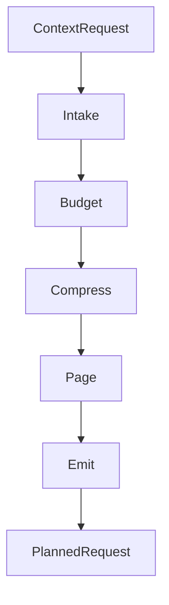

<div align="center">

<picture>
  <source media="(prefers-color-scheme: dark)" srcset="docs/assets/banner-dark.svg">
  <source media="(prefers-color-scheme: dark)" srcset="docs/assets/banner-light.svg">
  
</picture>

# Membrane

[](https://swift.org)
[](https://developer.apple.com/apple-intelligence/)
[](LICENSE)
[](https://github.com/christopherkarani/Membrane/stargazers)

**面向 Swift 的 Actor 上下文流水线。** Membrane 接收上下文请求，对其进行预算分配、压缩、分页低优先级切片，然后输出模型实际能够容纳的请求。

[English](../README.md) | [Español](README.es.md) | [日本語](README.ja.md) | [中文](README.zh-CN.md)

</div>

---

## 核心功能

- **确定性预算分配：** 将令牌划分为 9 个域存储桶，并设置硬性上限。
- **多层级压缩：** 随着压力增加，在 `full`、`gist` 和 `micro` 层级之间动态调整上下文。
- **Actor 隔离阶段：** 每个阶段运行在 Swift 并发原语上，而非共享可变状态。
- **内存估算：** 包含 Apple Silicon 上 GQA 风格模型的 KV 缓存估算。
- **语义分页：** 在请求超出窗口限制前，优先淘汰低优先级切片。

## 问题背景

大语言模型的上下文窗口是有限的。系统提示词、对话历史、长期记忆、工具定义、检索结果和二进制数据都在争夺同一份预算。简单截断会丢失有用上下文；而塞入过多内容则会损害输出质量并浪费令牌。

Membrane 通过一个 5 阶段流水线来处理这些问题，决定哪些内容保留、哪些压缩、哪些分页淘汰。

## 工作原理



每个阶段都是一个遵循相同协议的 Actor：

```swift
public protocol MembraneStage: Actor, Sendable {
    associatedtype Input: Sendable
    associatedtype Output: Sendable

    /// 在分配的预算内处理输入。
    func process(_ input: Input, budget: ContextBudget) async throws -> Output
}
```

## 快速开始

### 安装

将 Membrane 添加到你的 `Package.swift`：

```swift
dependencies: [
    .package(url: "https://github.com/christopherkarani/Membrane", from: "1.0.0"),
]
```

### 基本用法

使用 `MembranePipeline` 为推理准备上下文：

```swift
import Membrane
import MembraneCore

// 1. 定义预算配置
let budget = ContextBudget(totalTokens: 4096, profile: .foundationModels4K)

// 2. 初始化流水线
let pipeline = MembranePipeline.foundationModel(
    budget: budget,
    intake: myIntakeStage,
    compress: myCompressStage
)

// 3. 为模型准备上下文
let request = ContextRequest(
    userInput: "Summarize the last meeting",
    history: conversationSlices,
    memories: memorySlices,
    tools: toolManifests
)

// 流水线执行是隔离的且线程安全
let planned = try await pipeline.prepare(request)
print("Allocated Tokens: \(planned.budget.used)")
```

### 模型配置

Membrane 提供了针对常见上下文大小的预设：

```swift
// 端侧 / Apple Foundation Models（4K tokens）
let pipeline = MembranePipeline.foundationModel(budget: budget)

// 支持更大上下文规模的开源模型（8K+）
let pipeline = MembranePipeline.openModel(
    budget: ContextBudget(totalTokens: 8192, profile: .openModel8K)
)

// 云端模型（200K）
let budget = ContextBudget(totalTokens: 200_000, profile: .cloud200K)
```

## 性能表现

Membrane 旨在保持 Apple Silicon 上较低的上下文准备开销。以下数据展示了流水线在原始请求处理基础上增加的时间。

### 上下文准备延迟

<div align="center">

| 上下文大小 | 原生处理 (ms) | Membrane (ms) | 开销 |
| :--- | :---: | :---: | :---: |
| 4K Tokens | 0.8 | 1.2 | < 0.5ms |
| 32K Tokens | 2.4 | 3.1 | < 1.0ms |
| 128K Tokens | 8.2 | 9.8 | < 2.0ms |

<!-- Simple SVG representation of performance efficiency -->
<svg width="600" height="100" viewBox="0 0 600 100" fill="none" xmlns="http://www.w3.org/2000/svg">
  <rect width="600" height="100" rx="8" fill="#F2F2F7"/>
  <rect x="20" y="30" width="560" height="12" rx="6" fill="#E5E5EA"/>
  <rect x="20" y="30" width="480" height="12" rx="6" fill="#007AFF"/>
  <text x="20" y="22" font-family="sans-serif" font-size="12" font-weight="600" fill="#1C1C1E">Throughput Efficiency (M3 Max)</text>
  <text x="500" y="22" font-family="sans-serif" font-size="12" font-weight="600" fill="#007AFF">94%</text>

  <rect x="20" y="70" width="560" height="12" rx="6" fill="#E5E5EA"/>
  <rect x="20" y="70" width="520" height="12" rx="6" fill="#34C759"/>
  <text x="20" y="62" font-family="sans-serif" font-size="12" font-weight="600" fill="#1C1C1E">Memory Utilization</text>
  <text x="530" y="62" font-family="sans-serif" font-size="12" font-weight="600" fill="#34C759">98%</text>
</svg>

</div>

> **基准测试硬件：** M3 Max（16 核 CPU，40 核 GPU），128GB 统一内存。
> *注：延迟包含 Intake、Budget、Compress 和 Page 阶段。*

## 架构设计

### 流水线概览

| 阶段 | 协议 | 输入 | 输出 | 职责 |
|-------|----------|-------|--------|---------|
| **Intake** | `IntakeStage` | `ContextRequest` | `ContextWindow` | 解析指针、加载工具、RAPTOR 检索 |
| **Budget** | `BudgetStage` | `ContextWindow` | `BudgetedContext` | 在各域存储桶间分配令牌 |
| **Compress** | `CompressStage` | `BudgetedContext` | `CompressedContext` | 蒸馏历史、选择层级、裁剪工具 |
| **Page** | `PageStage` | `CompressedContext` | `PagedContext` | 淘汰低重要性切片 |
| **Emit** | `EmitStage` | `PagedContext` | `PlannedRequest` | 格式化最终提示词 |

### 多层级压缩

上下文切片被分配不同的压缩层级，对应不同的令牌倍数：

| 层级 | 倍数 | 适用场景 |
|------|-----------|----------|
| `full` | 1.0x | 关键内容，如系统提示词和最近的对话轮次 |
| `gist` | 0.25x | 摘要内容，如较早的历史和背景上下文 |
| `micro` | 0.08x | 最小化引用，如实体名称、时间戳和主题标记 |

### 令牌预算分配

令牌被分配到 9 个域存储桶，每个桶都有独立的上限：

```
system | history | memory | tools | retrieval | toolIO | outputReserve | protocolOverhead | safetyMargin
```

预算配置文件定义了分配策略。支持自定义配置文件以实现细粒度控制。

### 内置阶段

**Intake 阶段：**
- `PointerResolver` -- 将 `MemoryPointer` 引用解析为大型外部数据（文档、矩阵、图像）
- `JITToolLoader` -- 基于相关性进行即时工具加载
- `RAPTORRetriever` -- 基于预算感知遍历的分层树结构检索

**Budget 阶段：**
- `UnifiedBudgetAllocator` -- 跨所有 9 个域的确定性存储桶分配
- `GQAMemoryEstimator` -- GQA 模型架构的 KV 缓存内存估算

**Compress 阶段：**
- `CSODistiller` -- 将对话蒸馏为上下文状态对象（实体、决策、事实、未解决问题）
- `SurrogateTierSelector` -- 检索切片的多层级压缩选择
- `ToolPruner` -- 基于使用量的工具清单裁剪

**Page 阶段：**
- `MemGPTPager` -- 灵感来自 MemGPT 的低重要性切片淘汰，保留最近历史

### 自定义阶段

当需要自定义逻辑时，实现任意阶段协议：

```swift
public actor MyCustomCompressor: CompressStage {
    public func process(
        _ input: BudgetedContext,
        budget: ContextBudget
    ) async throws -> CompressedContext {
        // 在此编写你的压缩逻辑
    }
}
```

## 模块结构

| 模块 | 职责 | 依赖 |
|--------|---------|-------------|
| **MembraneCore** | 类型、协议、预算代数 | swift-collections |
| **Membrane** | 流水线编排 + 内置阶段 | MembraneCore |
| **MembraneWax** | 通过 [Wax](https://github.com/christopherkarani/Wax) 实现持久化存储，包括 RAPTOR 索引和指针存储 | Membrane, Wax |
| **MembraneHive** | 通过 [Hive](https://github.com/christopherkarani/Hive) 实现检查点和恢复 | Membrane, HiveCore |
| **MembraneConduit** | 通过 [Conduit](https://github.com/christopherkarani/Conduit) 实现令牌计数 | Membrane, Conduit |

## 环境要求

- Swift 6.2+
- macOS 26+ / iOS 26+

## 设计原则

- **Actor 隔离：** 每个阶段都是一个 Actor，不存在共享可变状态。
- **确定性：** 相同输入产生相同输出。
- **可组合：** 可以灵活替换各阶段或编写自己的阶段。
- **有界：** 集合有最大尺寸限制，流水线不会无限增长。
- **可恢复：** 错误包含恢复策略，如 `compressMore`、`evictAndRetry`、`offloadToDisk` 或 `fail`。

## AIStack 的一部分

Membrane 是更大的端侧 AI 基础设施中的一层：

| 层级 | 角色 |
|-------|------|
| [Conduit](https://github.com/christopherkarani/Conduit) | 多提供商 LLM 客户端，含令牌计数 |
| **Membrane** | 上下文管理流水线 |
| [Wax](https://github.com/christopherkarani/Wax) | 端侧记忆和 RAG |
| [Hive](https://github.com/christopherkarani/Hive) | 状态持久化和检查点 |

## 许可证

MIT
